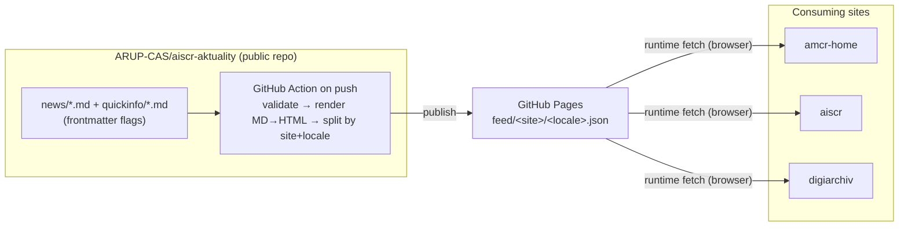

# Proposal: Shared *Aktuality* Feed Across Multiple Sites

- **Status:** Draft / for review
- **Date:** 2026-07-19
- **Scope:** News (*aktuality*) and quick-info items shared across AIS CR web properties
- **Decisions already taken:** runtime fetch delivery · public GitHub repo + GitHub Pages hosting

---

## 1. Problem

News and short "quick info" notices currently have to be authored **per site**. The same
announcement (e.g. an outage, a new release) is copy-pasted into several codebases, drifts out
of sync, and every change means editing and redeploying each site individually.

We want a **single source of truth**: write a news item **once**, tag it with **where it should
appear**, and have every consuming site pick it up automatically.

## 2. Goal

- One central, Markdown-based content repository for all *aktuality* + quick-info.
- Per-item **flags** that declare which site(s)/channel(s) the item is shown on.
- Consuming sites render the items flagged for them, in the right language.
- Editors work in Markdown + Git; no per-site code changes to publish news.

## 3. Current state (this site)

- Fully **static** build (`@sveltejs/adapter-static`) — everything is prerendered, no server runtime.
- News lives in `src/content/news/*.md` with frontmatter
  (`slug, title, excerpt, date, time, badge, published, locale, image`), one file per language.
- Loaded at **build time** via `import.meta.glob('/src/content/news/*.md', { eager: true })` and
  baked into the output. Article pages `/aktuality/[slug]` are prerendered from those files.

This static nature is the main constraint the design has to respect.

## 4. Proposed architecture

Three moving parts:



### 4.1 Content repository — `ARUP-CAS/aiscr-aktuality` (public)

```
news/2024-08-04-nova-amcr.cs.md
news/2024-08-04-nova-amcr.en.md
quickinfo/2025-01-vypadek-digiarchiv.cs.md
```

Frontmatter carries the metadata **and the flags**:

```yaml
type: news                              # news | quickinfo
sites: [amcr-home, aiscr, digiarchiv]   # ← which sites show this item
date: 2024-08-04
time: "12:00"
badge: Novinka
published: true
locale: cs
title: Nová AMČR spuštěna
excerpt: Byla spuštěna nová webová aplikace AMČR.
image: /images/placeholder.webp
```

- `sites` is the core flag — an item with `sites: [amcr-home]` shows only here; `sites: [aiscr, amcr-home]`
  shows on both.
- `type` separates full news articles from short quick-info banner notices.
- `locale` keeps the existing one-file-per-language convention; a `slug` shared across languages links translations.

### 4.2 Feed builder — GitHub Action (runs on every push)

1. Validate frontmatter (required keys, known `sites`/`type`, valid dates).
2. Render Markdown → HTML **once**, centrally, so no consuming site re-implements the pipeline
   (and formatting stays identical everywhere).
3. Filter + split into **per-site, per-locale** JSON files.
4. Publish to GitHub Pages.

Output URLs:

```
https://arup-cas.github.io/aiscr-aktuality/feed/amcr-home/cs.json
https://arup-cas.github.io/aiscr-aktuality/feed/amcr-home/en.json
https://arup-cas.github.io/aiscr-aktuality/feed/aiscr/cs.json
...
```

Feed shape:

```json
{
  "generated": "2026-07-19T12:00:00Z",
  "items": [
    {
      "slug": "nova-amcr-spustena",
      "type": "news",
      "date": "2024-08-04",
      "time": "12:00",
      "badge": "Novinka",
      "title": "Nová AMČR spuštěna",
      "excerpt": "Byla spuštěna nová webová aplikace AMČR.",
      "image": "https://arup-cas.github.io/aiscr-aktuality/images/placeholder.webp",
      "html": "<p>S velkou radostí…</p>"
    }
  ]
}
```

Items are pre-sorted (newest first) so consumers don't have to.

### 4.3 Consuming site — runtime fetch

- On mount, the news list and quick-info banner `fetch()` their `feed/<site>/<locale>.json`.
- Filter by `type` (`news` for the list/article view, `quickinfo` for the banner).
- Render; item body HTML is injected with `{@html}` (already the pattern used for FAQ content here).
- Show a skeleton while loading; cache the response in `sessionStorage` to avoid a refetch on
  in-session navigation.

## 5. Why runtime fetch (decision)

Chosen over build-time ingestion and a hybrid:

| Model | Freshness | SEO of items | Rebuilds on news change | Complexity |
|-------|-----------|--------------|-------------------------|------------|
| Build-time + auto-rebuild | ~1–2 min (redeploy) | Strong (in HTML) | Every flagged site rebuilds | Medium |
| **Runtime fetch (chosen)** | **Instant** | Weak (client-rendered) | **None** | **Low** |
| Hybrid | Instant | Strong baseline | Optional | Higher |

Runtime fetch was selected for **instant updates with zero site rebuilds** and the simplest
integration, accepting weaker SEO for individual items.

## 6. Open questions / things to resolve before implementation

1. **Article pages `/aktuality/[slug]`.** With a static adapter, dynamic slugs can't be prerendered
   from a runtime feed. Options:
   - keep standalone article URLs via `adapter-static` `fallback: '200.html'` (SPA fallback that
     fetches the single item by slug client-side), **or**
   - drop standalone article pages and expand items inline / link out.
   *Needs a decision; the list and banner are unaffected either way.*
2. **HTML trust.** Feed ships pre-rendered HTML that we `{@html}`. Content is first-party (our repo),
   but the builder should still sanitize during MD→HTML.
3. **Caching / versioning.** GitHub Pages cache headers + a `generated` timestamp (or ETag) so
   consumers can cheaply detect "nothing new".
4. **Site identifiers.** Agree a fixed list of `sites` slugs (`amcr-home`, `aiscr`, `digiarchiv`, …)
   and validate against it in CI.
5. **Images.** Store item images in the content repo (served from Pages) or keep per-site — feed
   should emit absolute URLs either way.

## 7. Rollout (suggested phases)

1. **PoC (consumer):** in this repo, point `News.svelte` / `NewsBanner.svelte` at a **mock**
   `feed/amcr-home/cs.json` in `/static`; prove fetch + render + skeleton + caching.
2. **Content repo + Action:** stand up `aiscr-aktuality`, migrate existing `src/content/news/*.md`,
   ship the publish Action to GitHub Pages.
3. **Swap:** replace the mock URL with the live Pages URL; remove the local `import.meta.glob` news
   loader once parity is confirmed.
4. **Onboard other sites:** each site adds the same fetch, filtered to its own `sites` flag.

## 8. Non-goals

- No CMS / admin UI — editing stays in Git + Markdown.
- No per-site rendering divergence — HTML is rendered centrally.
- No server runtime on consuming sites — they remain static + client fetch.
